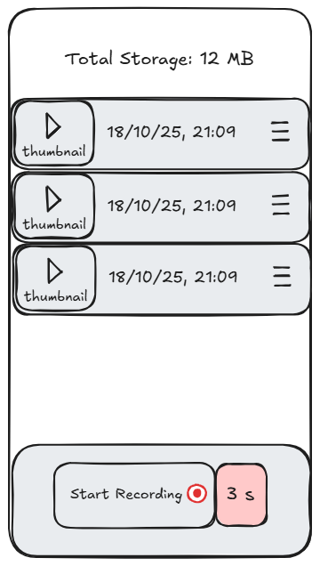

# Welcome to Mobile Video Diary App

To run the application on your mobile, download the Expo Go app from AppStore or PlayStore. Then create an account and sign in. 


Ensure you have Node.js and Git installed on your computer. You can download Node.js [here](https://nodejs.org/en/download/current) and Git [here](https://git-scm.com/install/). Once you have both these softwares installed, open a terminal in the directory where you want to install the application. Clone this repo using `git clone https://github.com/novojitsaha/facecap` and change the current working directory to the project root directory. Then follow the steps below: 

1. Install dependencies

   ```bash
   npm install
   ```

2. Start the app

   ```bash
   npx expo start
   ```

In the output, you'll find a QR code which you have to scan with your Expo Go, and you should be able to run the app. 

### Initial Wireframe



You can find the Excalidraw link [here](https://excalidraw.com/#json=i3lmuT7rieyIizE8GF-QC,_KKkzh3P6p4PPCFtOhAHSQ).

### Deliverables
You can find the requested documentation [here](./FaceCap%20Assignment%20(1).pdf).

### Demo Video
You can find a quick Youtube Demo [here](https://www.youtube.com/watch?v=7rv8ghHPNXI).

